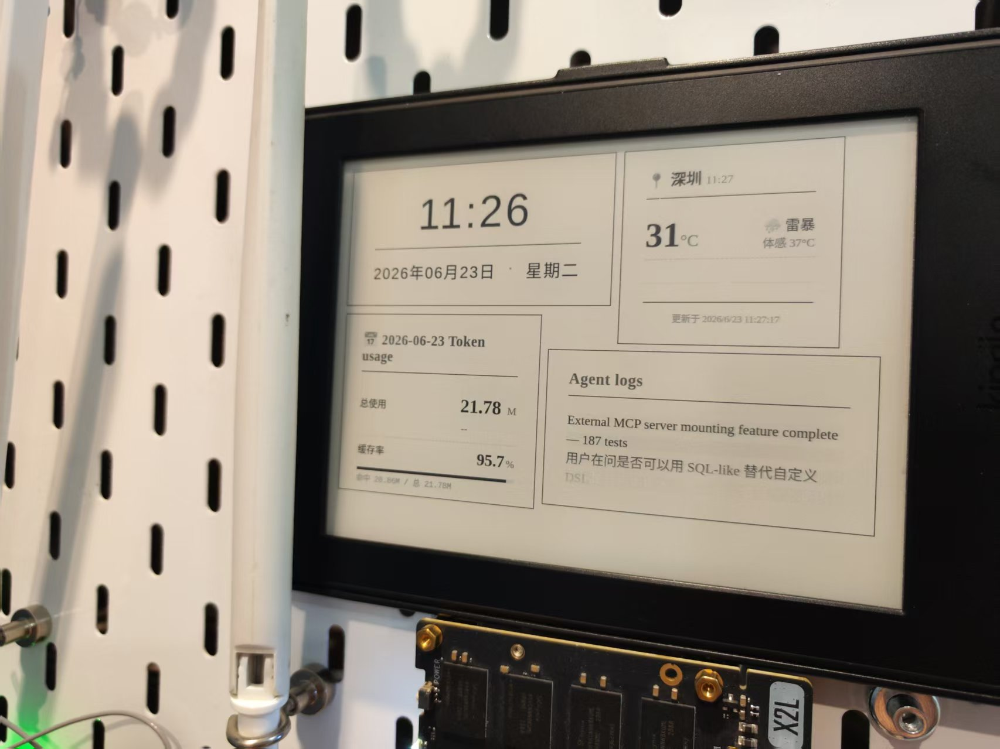

# 🧩 Tileboard

**Build your own live dashboard via html, and display it on any devices that can display a png image**

Tileboard is a lightweight, MQTT‑driven dashboard where every tile is a tiny web page.
---

## ✨ Features

- **Dynamic tiles** – add, update, or remove tiles via MQTT messages
- **Live preview** – built‑in Monaco editor with instant preview
- **Priority & eviction** – set priority and auto‑timeout to manage screen space
- **Static tiles** – load YAML files on startup for permanent tiles
- **Kindle support** – turn your e‑reader into a low‑power display
- **Shows anywhere** -- any devices that shows png files can turn into a multi-functional dashboard

---

## 🚀 Quick Start

1. **Download** the AppImage and run:
   
   `./Tileboard.AppImage --headless`

2. **Open** your browser at `http://SERVER_IP:3456/`

3. **Start building** – use the Tile Studio to create your first tile.

4. **Connecting** – Configure your display to show the dashboard

---

## ⚙️ Configuration

On first run, Tileboard creates `~/.config/tileboard/config.json`. You can tweak these settings:

| Option                   | Description                                     |
| ------------------------ | ----------------------------------------------- |
| `viewport.width/height`  | Board resolution in pixels                      |
| `mqtt.url`               | MQTT broker URL (e.g., `mqtt://localhost:1883`) |
| `mqtt.topic`             | Topic to listen for tile updates                |
| `mqtt.username/password` | Optional credentials                            |
| `headless`               | Run without UI (set to `true` for servers)      |
| `scale`                  | Render scale factor                             |
| `httpPort`               | Port for the web interface                      |

Environment variables override the config:  
`TILEBOARD_MQTT_URL`, `TILEBOARD_MQTT_USERNAME`, `TILEBOARD_MQTT_PASSWORD`, `TILEBOARD_HEADLESS=true`, `TILEBOARD_HTTP_PORT`.

---

## 📡 Dynamic Tiles via MQTT

Publish a JSON message to the configured MQTT topic (default `tileboard/update`):

{ "id": "sensor-1", "content": "
23.5°C
", "priority": 50 }

| Field      | Description                                                                        |
| ---------- | ---------------------------------------------------------------------------------- |
| `id`       | Unique tile identifier                                                             |
| `content`  | HTML string (can include `
  

  

---

## 📖 Kindle Integration

Turn your Kindle into an always‑on dashboard – see [kindle/README.md](kindle/README.md) for step‑by‑step instructions.

---

## 🔧 Advanced Tips

- **Scaling** – adjust `scale` in config to fit high‑DPI screens
- **Headless operation** – perfect for Raspberry Pi, just set `"headless": true`
- **Security** – use MQTT with TLS or username/password; the HTTP server is minimal – consider putting it behind a reverse proxy if exposed to the internet

---

## 🤝 Contributing

Issues and pull requests are welcome!  
Feel free to open a discussion if you have ideas for new features.

---

## 📄 License

MIT – use it anywhere, modify it freely.
